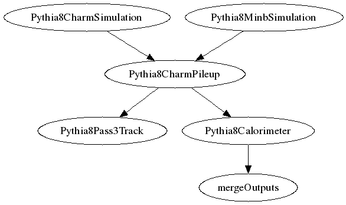

## SHREK Inputs
- /direct/sphenix+u/jwebb2/work/2022/SHREK/shrek/tests/pythia8-charm-simulation-full/runCharmSimu.yaml
- /direct/sphenix+u/jwebb2/work/2022/SHREK/shrek/tests/pythia8-charm-simulation-full/runMinbSimu.yaml
- /direct/sphenix+u/jwebb2/work/2022/SHREK/shrek/tests/pythia8-charm-simulation-full/runPileup.yaml
## Generated scripts
- Pythia8CharmSimulation.sh
- Pythia8MinbSimulation.sh
- Pythia8CharmPileup.sh
## Job resources
- /direct/sphenix+u/jwebb2/work/2022/SHREK/MDC2/submit/HF_pp200_signal/pass2/rundir/Fun4All_G4_Pileup_pp.C
- /direct/sphenix+u/jwebb2/work/2022/SHREK/MDC2/submit/HF_pp200_signal/pass2/rundir/G4_OutputManager_Pileup_pp.C
- /direct/sphenix+u/jwebb2/work/2022/SHREK/MDC2/submit/HF_pp200_signal/pass2/rundir/copyscript.pl
- /direct/sphenix+u/jwebb2/work/2022/SHREK/MDC2/submit/HF_pp200_signal/pass2/rundir/getinputfiles.pl
- /direct/sphenix+u/jwebb2/work/2022/SHREK/MDC2/submit/HF_pp200_signal/pass2/rundir/run_pileup.sh
## Job dependencies

- Pythia8CharmSimulation

  outputs:
  - Pythia8CharmSimulation/outDS
- Pythia8MinbSimulation

  outputs:
  - Pythia8MinbSimulation/outDS
- Pythia8CharmPileup
  inputs:
  - Pythia8CharmSimulation/outDS
  - Pythia8MinbSimulation/outDS

  outputs:
  - Pythia8CharmPileup/outDS
## PanDA Monitoring
[panda monitoring](https://panda-doma.cern.ch/tasks/?taskname=user.jwebb2.sP22a-hfcharm-88ba54b8-f248-11ec-964b-00163e101048_*)
