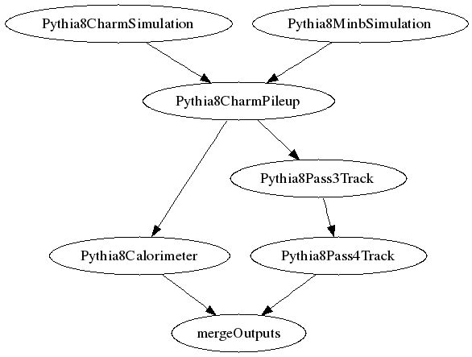

## SHREK Inputs
- /direct/sphenix+u/jwebb2/work/2022/SHREK/shrek/tests/pythia8-charm-simulation-full/runCharmSimu.yaml
- /direct/sphenix+u/jwebb2/work/2022/SHREK/shrek/tests/pythia8-charm-simulation-full/runMinbSimu.yaml
- /direct/sphenix+u/jwebb2/work/2022/SHREK/shrek/tests/pythia8-charm-simulation-full/runPileup.yaml
- /direct/sphenix+u/jwebb2/work/2022/SHREK/shrek/tests/pythia8-charm-simulation-full/runPass3Track.yaml
- /direct/sphenix+u/jwebb2/work/2022/SHREK/shrek/tests/pythia8-charm-simulation-full/runCalorimeter.yaml
- /direct/sphenix+u/jwebb2/work/2022/SHREK/shrek/tests/pythia8-charm-simulation-full/runPass4Track.yaml
- /direct/sphenix+u/jwebb2/work/2022/SHREK/shrek/tests/pythia8-charm-simulation-full/mergeOutputs.yaml
## Generated scripts
- Pythia8CharmSimulation.sh
- Pythia8MinbSimulation.sh
- Pythia8CharmPileup.sh
- Pythia8Pass3Track.sh
- Pythia8Calorimeter.sh
- Pythia8Pass4Track.sh
- mergeOutputs.sh
## Job resources
- none
## Job dependencies

- Pythia8CharmSimulation

  outputs:
  - Pythia8CharmSimulation/outDS
- Pythia8MinbSimulation

  outputs:
  - Pythia8MinbSimulation/outDS
- Pythia8CharmPileup
  inputs:
  - Pythia8CharmSimulation/outDS
  - Pythia8MinbSimulation/outDS

  outputs:
  - Pythia8CharmPileup/outDS
- Pythia8Pass3Track
  inputs:
  - Pythia8CharmPileup/outDS

  outputs:
  - Pythia8Pass3Track/outDS
- Pythia8Calorimeter
  inputs:
  - Pythia8CharmPileup/outDS

  outputs:
  - Pythia8Calorimeter/outDS
- Pythia8Pass4Track
  inputs:
  - Pythia8Pass3Track/outDS

  outputs:
  - Pythia8Pass4Track/outDS
- mergeOutputs
  inputs:
  - Pythia8Calorimeter/outDS
  - Pythia8Pass4Track/outDS

  outputs:
  - Pythia8CharmOutput/outDS
## PanDA Monitoring
[panda monitoring](https://panda-doma.cern.ch/tasks/?taskname=user.jwebb2.sP22a-hfcharm-70c3393a-0827-11ed-ac20-00163e101049_*)
