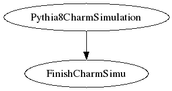

## SHREK Inputs
- /direct/sphenix+u/jwebb2/work/2022/SHREK/shrek/workflows/HF_pp200_threestep/runCharmSimuFinish.yaml
- /direct/sphenix+u/jwebb2/work/2022/SHREK/shrek/workflows/HF_pp200_threestep/runCharmSimu.yaml
## Generated scripts
- runCharmSimuFinish.sh
- Pythia8CharmSimulation.sh
## Job resources
- /direct/sphenix+u/jwebb2/work/2022/SHREK/MDC2/submit/HF_pp200_signal/pass1/rundir/DisplayOn.C
- /direct/sphenix+u/jwebb2/work/2022/SHREK/MDC2/submit/HF_pp200_signal/pass1/rundir/Fun4All_G4_HF_pp_signal.C
- /direct/sphenix+u/jwebb2/work/2022/SHREK/MDC2/submit/HF_pp200_signal/pass1/rundir/G4Setup_sPHENIX.C
- /direct/sphenix+u/jwebb2/work/2022/SHREK/MDC2/submit/HF_pp200_signal/pass1/rundir/G4_Production.C
- /direct/sphenix+u/jwebb2/work/2022/SHREK/MDC2/submit/HF_pp200_signal/pass1/rundir/copyscript.pl
- /direct/sphenix+u/jwebb2/work/2022/SHREK/MDC2/submit/HF_pp200_signal/pass1/rundir/init_gui_vis.mac
- /direct/sphenix+u/jwebb2/work/2022/SHREK/MDC2/submit/HF_pp200_signal/pass1/rundir/phpythia8_HF_MDC2.cfg
- /direct/sphenix+u/jwebb2/work/2022/SHREK/MDC2/submit/HF_pp200_signal/pass1/rundir/phpythia8_d02kpi_MDC2.cfg
- /direct/sphenix+u/jwebb2/work/2022/SHREK/MDC2/submit/HF_pp200_signal/pass1/rundir/run_hfprod.sh
- /direct/sphenix+u/jwebb2/work/2022/SHREK/MDC2/submit/HF_pp200_signal/pass1/rundir/vis.mac
## Job dependencies

- runCharmSimuFinish
  inputs:
  - Pythia8CharmSimu/outDS

  outputs:
  - Pythia8CharmSimuFinish/outDS
- Pythia8CharmSimulation

  outputs:
  - Pythia8CharmSimu/outDS
## PanDA Monitoring
[panda monitoring](https://panda-doma.cern.ch/tasks/?taskname=user.jwebb2.sP22n-hfcharm-signal_*)
