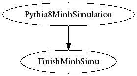

## SHREK Inputs
- /direct/sphenix+u/jwebb2/work/2022/SHREK/shrek/workflows/HF_pp200_charm-ana.315/finishMinbSimu.yaml
- /direct/sphenix+u/jwebb2/work/2022/SHREK/shrek/workflows/HF_pp200_charm-ana.315/runMinbSimu.yaml
## Generated scripts
- FinishMinbSimu.sh
- Pythia8MinbSimulation.sh
## Job resources
- /direct/sphenix+u/jwebb2/work/2022/SHREK/MDC2/submit/pythia8_pp_mb/pass1/rundir/DisplayOn.C
- /direct/sphenix+u/jwebb2/work/2022/SHREK/MDC2/submit/pythia8_pp_mb/pass1/rundir/Fun4All_G4_Pass1_pp.C
- /direct/sphenix+u/jwebb2/work/2022/SHREK/MDC2/submit/pythia8_pp_mb/pass1/rundir/G4Setup_sPHENIX.C
- /direct/sphenix+u/jwebb2/work/2022/SHREK/MDC2/submit/pythia8_pp_mb/pass1/rundir/G4_Production.C
- /direct/sphenix+u/jwebb2/work/2022/SHREK/MDC2/submit/pythia8_pp_mb/pass1/rundir/copyscript.pl
- /direct/sphenix+u/jwebb2/work/2022/SHREK/MDC2/submit/pythia8_pp_mb/pass1/rundir/init_gui_vis.mac
- /direct/sphenix+u/jwebb2/work/2022/SHREK/MDC2/submit/pythia8_pp_mb/pass1/rundir/run_pythia8_pp_mb.sh
- /direct/sphenix+u/jwebb2/work/2022/SHREK/MDC2/submit/pythia8_pp_mb/pass1/rundir/vis.mac
## Job dependencies

- FinishMinbSimu
  inputs:
  - Pythia8MinbSimulation/outDS

  outputs:
  - FinishPythia8MinbSimu/outDS
- Pythia8MinbSimulation

  outputs:
  - Pythia8MinbSimulation/outDS
## PanDA Monitoring
[panda monitoring](https://panda-doma.cern.ch/tasks/?taskname=user.jwebb2.sP22s-hfcharm-background-test5_*)
