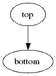

## SHREK Inputs
- /direct/sphenix+u/jwebb2/work/2022/SHREK/shrek/tests/simple-chain/bottom.yaml
- /direct/sphenix+u/jwebb2/work/2022/SHREK/shrek/tests/simple-chain/top.yaml
## Generated scripts
- bottom.sh
- top.sh
## Job resources
- none
## Job dependencies

## PanDA Monitoring
[panda monitoring](https://panda-doma.cern.ch/tasks/?taskname=user.jwebb2.simple-6efe79a0-ed93-11ec-99fc-00163e101048_*)
