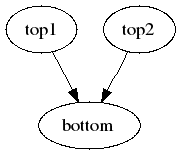

## SHREK Inputs
- /direct/sphenix+u/jwebb2/work/2022/SHREK/shrek/tests/simple-chain-2to1/bottom.yaml
- /direct/sphenix+u/jwebb2/work/2022/SHREK/shrek/tests/simple-chain-2to1/top1.yaml
- /direct/sphenix+u/jwebb2/work/2022/SHREK/shrek/tests/simple-chain-2to1/top2.yaml
- /direct/sphenix+u/jwebb2/work/2022/SHREK/shrek/tests/simple-chain-2to1/top.yaml
## Generated scripts
- bottom.sh
- top1.sh
- top2.sh
- top.sh
## Job resources
- none
## Job dependencies

- bottom
  inputs:
  - top1/outDS
  - top2/outDS

  outputs:
  - bottom/outDS
- top1

  outputs:
  - top1/outDS
- top2

  outputs:
  - top2/outDS
- top

  outputs:
  - top/outDS
## PanDA Monitoring
[panda monitoring](https://panda-doma.cern.ch/tasks/?taskname=user.jwebb2.simple21-3386e341-f318-11ec-b87e-00163e101049_*)
